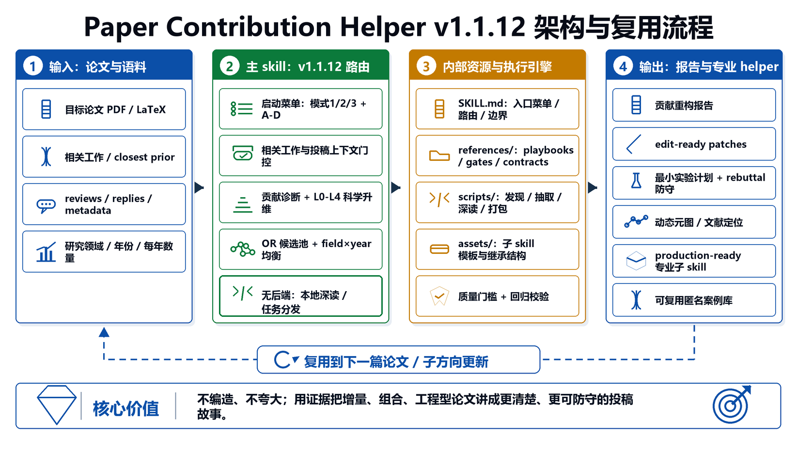
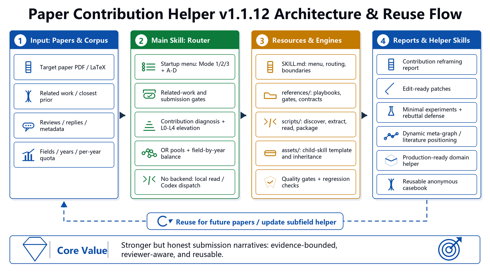

# 论文贡献助手 v1.1.12

`paper-contribution-helper skill`（中文名：论文贡献助手）是一个面向科研论文投稿前修改的 Codex skill 工厂，适合 **A+B+C 式组合创新**、增量创新、工程优化、轻量迁移、旧方法新场景适配，以及“工作做了但贡献讲不清”的论文。它的目标不是替作者编造 novelty，而是把论文里已经存在的方法、实验、约束和失败模式重新组织成更清楚、更强、更可防守的投稿叙事。感谢 University of Bristol 的刘欣阳同学提供 SemiDFL 素材支持，也感谢严世军和刘威丁提供的协助

当前说明只介绍 `paper-contribution-helper v1.1.12`。旧版本材料、旧 README、旧架构图和旧 SemiDFL 样例统一归档在 [`old_versions/`](old_versions/) 文件夹下。

当前主包：[`paper-contribution-helper-v1.1.12.zip`](paper-contribution-helper-v1.1.12.zip)



## 核心价值

这类论文往往不是“没有贡献”，而是容易被 reviewer 读成：

- 只是把已有模块 A、B、C 拼在一起；
- 只是旧方法在新场景里的小改动；
- 工程系统完整，但科学问题、失败模式和机制证据不够清楚；
- 实验结果不错，但没有说明每个模块到底回答了哪个审稿问题；
- rebuttal 只能写成空泛的 “we clarify” 或 “we will add discussion”。

v1.1.12 的核心原则是 **强而诚实**：不编造、不夸大、不脱离论文证据，而是把真实贡献讲清楚、讲准、讲得更可防守。它会把 target paper、相关工作、实验表格、reviewer 攻击、最小补实验计划和可替换文本放在同一条修改闭环里处理。

## v1.1.12 能做什么

### 1. 三种工作模式

启动 skill 后，v1.1.12 会先要求用户明确选择工作模式，不会替用户自动判断：

| 模式 | 用途 |
|---|---|
| 模式1 | 构建新的专业子 skill：以目标论文、相关工作、本地 PDF 或指定来源语料为种子，生成可复用领域 helper。 |
| 模式2 | 使用主包内置知识库分析论文：不生成新 skill，直接对当前 PDF 做贡献、风险、证据和改稿分析。 |
| 模式3 | 更新/扩展已有专业子 skill：把新论文、新 reviews、新语料或新流程合并进已有 child skill，并做继承回归检查。 |

生成出的专业子 skill 会保留更窄的使用界面：通常是 `模式A1` 直接分析论文，`模式A2` 更新/扩展该子 skill。

### 2. A-D 分析方向

分析方向可以组合，例如 `A+B+C+D`：

| 方向 | 关注点 |
|---|---|
| A | 贡献与相关工作：novelty、A+B+C/增量风险、closest prior、baseline、claim-evidence-risk。 |
| B | 分层改稿与科学升维：L0-L4，从句子/结构修改，到 failure mode、broken assumption、scientific question。 |
| C | 审稿防守与执行闭环：reviewer/AC 攻击、最小决定性实验、可替换文本、revision loop。 |
| D | 文献与前沿定位：动态元图、多跳检索计划、文献防幻觉、质量门槛、本地知识库/子方向沉淀。 |

### 3. 直接分析目标论文

模式2 适合已经有论文 PDF，需要快速知道“怎么改得更像一篇能投的论文”。v1.1.12 会先做两个门控：

- **相关工作门控**：询问作者是否有 closest prior、害怕被比较的论文、baseline、reviewer concerns 或 reviews/replies；如果没有，会从目标论文自己的 related work、references、实验设置和 frontier claims 里建立检索计划。
- **投稿上下文门控**：收集或假设目标 venue/journal、deadline、页数预算、实验预算和风险姿态。

最终报告会尽量给出可执行内容：

- 论文最可能被攻击成哪类增量或组合风险；
- 当前最可防守的贡献主线；
- claim-evidence-risk map；
- related work 边界与 closest prior 对照；
- abstract、introduction、contribution bullets、method overview、figure/table caption 的改写方向；
- reviewer/AC 攻击预演；
- 最小决定性实验，而不是泛泛地“多做实验”；
- rebuttal-safe wording 和危险话术提醒；
- 下一版 manuscript 的 revision loop 检查点。

### 4. 构建或更新专业子 skill

模式1/3 适合为某个研究方向沉淀可复用经验。v1.1.12 要求明确给出：

- 研究领域：一个或多个；
- 年份或年份范围；
- 每年数量；
- 来源会议、期刊、官网、数据库，或本地 PDF/project-run；
- 模式3 还需要已有子 skill。

v1.1.12 的语料规则很重要：多个研究领域、多个年份、多个来源、多个本地资料默认是 **OR 候选池**，不是 AND 交集过滤。例如“联邦学习 + 半监督学习，2023 + 2024，来源 ICLR”表示从这些候选池里做均衡筛选；如果你真的要交集，必须明确写“只取交集”。

当给出多个领域和多个年份时，它会按 `field × year` 尽量均衡分配每年数量；如果某个格子没有足够高质量论文，会诚实报告 quota gap，而不是用弱相关论文硬填。

### 5. 无后端时继续工作

如果已经有 PDF、reviews、replies、metadata 或 project-run，v1.1.12 会优先从本地项目文件继续处理。缺少 `OPENAI_API_KEY`、ACP/acpx 或本地 LLM 后端，不会自动变成终止理由；它会切换到当前助手可执行的本地深读协议，生成 assistant-readable packets、深读 JSONL、manifest，再恢复匿名知识合成和打包。

如果用户允许 Codex/ChatGPT worker 分工阅读，v1.1.12 也支持通过文件协议分发每篇论文的深读任务，收集 worker 写回的 JSON 记录，再继续构建子 skill。

### 6. 子 skill 继承和回归检查

生成出的 child skill 不是只有一个匿名案例库。v1.1.12 要求 child skill 继承主包的方法论，包括：

- 启动菜单和模式/方向选择；
- related-work intake；
- submission-context gate；
- L0-L4 分层改稿与科学升维；
- 文献防幻觉和 source-quality gate；
- edit-ready patch；
- minimal decisive experiment planner；
- revision loop；
- figure/table、baseline fairness、citation support 检查；
- child skill inheritance regression。

如果继承检查失败，子 skill 不应标记为 production-ready。

## 架构图说明

上方架构图描述的是 `paper-contribution-helper v1.1.12` 主包/skill factory 的整体工作流，不是某个领域子 skill 的内部图。

左侧输入目标论文、相关工作、reviews/replies、本地 PDF/project-run、研究领域、年份、来源和每年数量。中间主 skill 先通过启动菜单把任务拆成模式1/2/3 和 A-D 分析方向，再根据任务走直接论文分析、专业子 skill 构建或已有子 skill 更新。右侧输出包括目标论文贡献重构报告、edit-ready patches、最小实验计划、动态元图检索计划、可复用专业子 skill 和回归校验结果。

内部资源分工保持模块化：

- `SKILL.md`：只做启动菜单、路由和硬规则；
- `references/`：存放工作流、报告 playbook、证据边界、source-quality、rebuttal、科学升维和子 skill 继承规则；
- `scripts/`：负责语料发现、PDF 标准化、项目 run 校验、深读记录导入、匿名知识合成、打包和回归检查；
- `assets/domain-skill-template/`：提供生成专业子 skill 的模板、脚本和继承结构。

## SemiDFL v1.1.12 样例

当前样例在 [`example_semiDFL_v1.1.12/`](example_semiDFL_v1.1.12/) 中，感谢 University of Bristol 的刘欣阳同学提供 SemiDFL 素材支持。

目录说明：

- [`example_semiDFL_v1.1.12/semidfl.pdf`](example_semiDFL_v1.1.12/semidfl.pdf)：样例目标论文；
- [`example_semiDFL_v1.1.12/semidfl_contribution_report.md`](example_semiDFL_v1.1.12/semidfl_contribution_report.md)：v1.1.12 贡献包装分析报告；
- [`example_semiDFL_v1.1.12/federated-semisupervised-iclr-helper.zip`](example_semiDFL_v1.1.12/federated-semisupervised-iclr-helper.zip)：样例生成出的联邦学习/半监督学习方向 helper skill；
- [`example_semiDFL_v1.1.12/codex-child-skill-generation-and-analysis.mp4`](example_semiDFL_v1.1.12/codex-child-skill-generation-and-analysis.mp4)：Codex 中生成并使用 child skill 的记录；
- [`example_semiDFL_v1.1.12/chatgpt-web-main-skill-direct-analysis.png`](example_semiDFL_v1.1.12/chatgpt-web-main-skill-direct-analysis.png)：ChatGPT 网页版中使用主包知识库直接分析的截图；
- [`example_semiDFL_v1.1.12/chatgpt-web-federated-semisupervised-iclr-helper-analysis.png`](example_semiDFL_v1.1.12/chatgpt-web-federated-semisupervised-iclr-helper-analysis.png)：ChatGPT 网页版中使用已生成 helper skill 分析的截图。

SemiDFL 的关键改写方向是：不要只讲“我们组合了 pseudo-labeling、diffusion MixUp 和 adaptive aggregation”，而要讲成：

```text
SemiDFL addresses the supervision-consensus gap in decentralized semi-supervised FL:
without a server, labeled clients, unlabeled clients, and mixed clients cannot rely on
centralized calibration or shared validation. SemiDFL builds consensus first in the data
space and then in the model space, so pseudo-labels, generated samples, and aggregation
weights become comparable across non-IID neighborhoods.
```

换成更直接的话：SemiDFL 更强的主线不是“模块很多”，而是把去中心化半监督联邦学习里缺失的 supervision / data-space / model-space consensus 拆清楚，再用已有模块回答这些缺口。

## Codex 提示词案例

下面这些提示词来自 v1.1.12 的真实 Codex 使用流程，并做了路径泛化。实际使用时把文件名、领域、年份、来源和实验预算替换成自己的。

### 1. 启动主包

```text
启动 paper-contribution-helper-v1.1.12.zip 里的skill
```

### 2. 用主包构建新的专业子 skill

```text
直接使用paper-contribution-helper-v1.1.12.zip里的skill，模式1，方向A+B+C+D，研究领域=联邦学习+半监督学习，年份=2023+2024，每年数量=每年总共最多10篇，来源=iclr，构建子skill。
```

### 3. 用主包直接分析当前论文

```text
直接使用paper-contribution-helper-v1.1.12.zip里的skill，模式2，方向A+B+C+D，分析这篇论文。目标venue是ICLR，截止时间=2026-09-30，最多还能补2个实验。
```

### 4. 启动生成出的专业子 skill
使用 zip：

```text
启动 federated-semisupervised-iclr-helper.zip 里的skill
```

### 5. 用专业子 skill 分析论文

```text
直接使用federated-semisupervised-iclr-helper.zip里的skill，模式A1，方向A+B+C+D，分析这篇论文 semidfl.pdf。目标venue是ICLR，截止时间=2025，最多还能补2个实验。
```

### 6. 更新/扩展已有专业子 skill

```text
直接使用paper-contribution-helper-v1.1.12.zip里的skill，模式3，方向A+B+C+D，已有子skill=federated-semisupervised-iclr-helper.zip，研究领域=联邦学习+半监督学习，年份=2025+2026，每年数量=每年总共最多8篇，新增来源=iclr+neurips，本地资料=./new_papers，更新/扩展子skill。
```

### 7. 从本地 PDF/project-run 构建

```text
直接使用paper-contribution-helper-v1.1.12.zip里的skill，模式1，方向A+B+C+D，研究领域=医疗图像分割+弱监督学习，年份=2022-2025，每年数量=每年总共最多12篇，来源=本地PDF，本地资料=./papers，构建子skill。
```

## ChatGPT 网页版边界

主包的完整工厂能力应在 Codex 中运行，尤其是自动发现/下载语料、全文深读、生成和回归检查专业子 skill。ChatGPT 网页版更适合两类轻量用法：

1. 把 `paper-contribution-helper-v1.1.12.zip` 放进项目 Sources，直接用主包知识库分析论文；
2. 把已经在 Codex 中生成好的专业子 skill zip （federated-semisupervised-iclr-helper.zip） 放进 Sources，分析同方向论文。
3. 把要分析的论文 `semidfl.pdf` 也放进 Sources。

ChatGPT 网页版不适合作为完整的子 skill 构建环境。

### ChatGPT 网页版提示词示例

#### 直接分析的两步

第一步，启动 Sources 里的主包：

```text
启动 Sources 里 paper-contribution-helper-v1.1.12.zip 里的skill
```

第二步，直接分析论文：

```text
直接使用 paper-contribution-helper-v1.1.12.zip 里的skill，模式2，方向A+B+C+D，分析这篇论文 [semidfl.pdf](semidfl.pdf)。截止时间=2025，最多还能补2个实验。
```

#### 使用子 skill 分析的两步

第一步，启动 Sources 里的子 skill：

```text
启动 federated-semisupervised-iclr-helper.zip 里的skill
```

第二步，用子 skill 分析论文：

```text
直接使用federated-semisupervised-iclr-helper.zip里的skill，模式A1，方向D，分析 Sources 里的 semidfl.pdf。截止时间=2025，最多还能补2个实验。
```

---

# Paper Contribution Helper v1.1.12

`paper-contribution-helper skill` is a Codex skill factory for contribution framing, novelty-risk diagnosis, reviewer-defense preparation, and reusable domain-helper generation. It is designed for A+B+C-style component-combination papers, incremental papers, engineering-heavy systems, light method-transfer papers, and old-method-new-setting adaptation papers.

This README only describes `paper-contribution-helper v1.1.12`. Older packages, README files, architecture figures, and examples are archived under [`old_versions/`](old_versions/).

Current package: [`paper-contribution-helper-v1.1.12.zip`](paper-contribution-helper-v1.1.12.zip)



## What v1.1.12 Does

The skill has three explicit work modes:

| Mode | Purpose |
|---|---|
| Mode 1 | Build a new domain-specific helper skill from target papers, related work, local PDFs, project runs, or specified source pools. |
| Mode 2 | Analyze a target paper directly with the main package, without generating a new skill. |
| Mode 3 | Update or extend an existing domain helper skill with new papers, reviews, sources, or workflows. |

For paper analysis, A-D directions can be combined:

- **A**: contribution, related work, novelty risk, closest prior, baselines, claim-evidence-risk.
- **B**: L0-L4 revision, from wording and structure to failure modes, broken assumptions, and scientific-question elevation.
- **C**: reviewer/AC attack preplay, rebuttal-safe wording, minimal decisive experiments, revision loop.
- **D**: dynamic meta-graph, multi-hop literature plan, no-hallucination literature guard, quality gates, local knowledge-base construction.

## Key v1.1.12 Behavior

- It starts with a fixed menu and asks the user to choose mode and analysis directions instead of guessing the route.
- Direct target-paper analysis runs related-work intake and submission-context gates before producing a final report.
- Reports are action-oriented: claim-evidence-risk maps, closest-prior boundaries, edit-ready patches, minimal decisive experiments, reviewer attack preplay, figure/table checks, baseline fairness, and citation support.
- Child-skill construction treats multiple fields, years, sources, and local material sets as OR candidate pools by default. If several fields and years are supplied, it builds a balanced field-by-year quota plan and reports gaps honestly.
- Existing local PDFs, reviews, replies, metadata, and project runs have priority. Missing API keys or LLM backends are handoffs to local-file processing, not automatic terminal blockers.
- Generated child skills must inherit the parent methodology and pass startup, evidence, source-quality, execution-flow, and child-inheritance regression checks.

## Architecture

The architecture figure shows the main `paper-contribution-helper v1.1.12` package, not a single generated domain helper. Inputs include target papers, related work, local PDFs/project-runs, research fields, years, source pools, and per-year quotas. The main skill routes the task through Mode 1/2/3 and A-D directions, then either analyzes a target paper, builds a reusable domain helper, or updates an existing helper.

Internally:

- `SKILL.md` owns the startup menu and routing rules.
- `references/` stores workflow modules, report playbooks, evidence boundaries, source-quality gates, rebuttal rules, scientific-elevation guidance, and child-skill inheritance contracts.
- `scripts/` handles source discovery, local PDF normalization, project-run validation, deep-read record import, anonymous synthesis, packaging, and regression checks.
- `assets/domain-skill-template/` renders portable generated helper skills.

## SemiDFL Example

The current example is under [`example_semiDFL_v1.1.12/`](example_semiDFL_v1.1.12/):

Example directory contents:

- [`example_semiDFL_v1.1.12/semidfl.pdf`](example_semiDFL_v1.1.12/semidfl.pdf): sample target paper.
- [`example_semiDFL_v1.1.12/semidfl_contribution_report.md`](example_semiDFL_v1.1.12/semidfl_contribution_report.md): v1.1.12 contribution-framing analysis report.
- [`example_semiDFL_v1.1.12/federated-semisupervised-iclr-helper.zip`](example_semiDFL_v1.1.12/federated-semisupervised-iclr-helper.zip): generated helper skill for federated learning / semi-supervised learning.
- [`example_semiDFL_v1.1.12/codex-child-skill-generation-and-analysis.mp4`](example_semiDFL_v1.1.12/codex-child-skill-generation-and-analysis.mp4): Codex recording for generating and using the child skill.
- [`example_semiDFL_v1.1.12/chatgpt-web-main-skill-direct-analysis.png`](example_semiDFL_v1.1.12/chatgpt-web-main-skill-direct-analysis.png): ChatGPT web screenshot for direct analysis with the main package.
- [`example_semiDFL_v1.1.12/chatgpt-web-federated-semisupervised-iclr-helper-analysis.png`](example_semiDFL_v1.1.12/chatgpt-web-federated-semisupervised-iclr-helper-analysis.png): ChatGPT web screenshot for analysis with the generated helper skill.

The stronger SemiDFL framing is not “we combine pseudo-labeling, diffusion MixUp, and adaptive aggregation.” It is:

```text
SemiDFL addresses the supervision-consensus gap in decentralized semi-supervised FL:
without a server, labeled clients, unlabeled clients, and mixed clients cannot rely on
centralized calibration or shared validation. SemiDFL builds consensus first in the data
space and then in the model space, so pseudo-labels, generated samples, and aggregation
weights become comparable across non-IID neighborhoods.
```

## Codex Prompt Examples

These prompts come from the real v1.1.12 Codex workflow, with paths generalized. Replace filenames, fields, years, sources, and experiment budgets as needed.

### 1. Start The Main Package

```text
Start the skill inside paper-contribution-helper-v1.1.12.zip.
```

### 2. Build A New Domain Helper With The Main Package

```text
Directly use the skill inside paper-contribution-helper-v1.1.12.zip. Mode 1, directions A+B+C+D, research fields=federated learning + semi-supervised learning, years=2023+2024, per-year quota=up to 10 papers total per year, source=ICLR, build a child skill.
```

### 3. Analyze The Current Paper Directly With The Main Package

```text
Directly use the skill inside paper-contribution-helper-v1.1.12.zip. Mode 2, directions A+B+C+D, analyze this paper. Target venue=ICLR, deadline=2026-09-30, at most 2 additional experiments can still be added.
```

### 4. Start A Generated Child Skill

```text
Start the skill inside federated-semisupervised-iclr-helper.zip.
```

### 5. Analyze A Paper With A Generated Child Skill

```text
Directly use the skill inside federated-semisupervised-iclr-helper.zip. Mode A1, directions A+B+C+D, analyze this paper semidfl.pdf. Target venue=ICLR, deadline=2025, at most 2 additional experiments can still be added.
```

### 6. Update Or Extend An Existing Child Skill

```text
Directly use the skill inside paper-contribution-helper-v1.1.12.zip. Mode 3, directions A+B+C+D, existing child skill=federated-semisupervised-iclr-helper.zip, research fields=federated learning + semi-supervised learning, years=2025+2026, per-year quota=up to 8 papers total per year, new sources=ICLR+NeurIPS, local materials=./new_papers, update/extend the child skill.
```

### 7. Build From Local PDFs Or A Project Run

```text
Directly use the skill inside paper-contribution-helper-v1.1.12.zip. Mode 1, directions A+B+C+D, research fields=medical image segmentation + weakly supervised learning, years=2022-2025, per-year quota=up to 12 papers total per year, source=local PDFs, local materials=./papers, build a child skill.
```

## ChatGPT Web Boundary

Run the full factory workflow in Codex when you need corpus discovery, full-paper reading, child-skill generation, packaging, or regression checks. ChatGPT web is better for two lightweight uses:

1. Put `paper-contribution-helper-v1.1.12.zip` in project Sources and analyze a paper directly with the main package knowledge base.
2. Put an already generated domain helper skill zip (`federated-semisupervised-iclr-helper.zip`) in Sources and analyze a paper in the same direction.
3. Put the target paper `semidfl.pdf` in Sources as well.

ChatGPT web is not suitable as the full child-skill construction environment.

### ChatGPT Web Prompt Examples

#### Direct Analysis In Two Turns

Turn 1, start the main package from Sources:

```text
Start the skill inside paper-contribution-helper-v1.1.12.zip from Sources.
```

Turn 2, analyze the paper directly:

```text
Directly use the skill inside paper-contribution-helper-v1.1.12.zip. Mode 2, directions A+B+C+D, analyze this paper [semidfl.pdf](semidfl.pdf). Deadline=2025, at most 2 additional experiments can still be added.
```

#### Child Skill Analysis In Two Turns

Turn 1, start the child skill from Sources:

```text
Start the skill inside federated-semisupervised-iclr-helper.zip.
```

Turn 2, analyze the paper with the child skill:

```text
Directly use the skill inside federated-semisupervised-iclr-helper.zip. Mode A1, direction D, analyze semidfl.pdf from Sources. Deadline=2025, at most 2 additional experiments can still be added.
```
